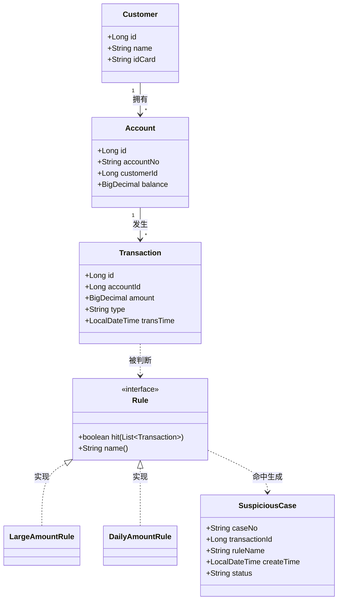

# mini-aml

一个用于学习 Java 后端开发的最小反洗钱（AML）交易监测系统。

## 项目简介

模拟银行反洗钱系统的基本流程：

- 客户（Customer）拥有账户（Account）
- 账户上发生交易（Transaction）
- 规则（Rule）判断交易是否可疑
- 命中的结果会用于后续生成可疑案例（SuspiciousCase）

## 当前版本 v0.1

- 实现单笔大额交易规则（金额 ≥ 50000 命中）
- 控制台输出判断结果

## 技术栈

- Java 17
- Maven
- Git

## 项目结构

    src/main/java/com/miniaml/
    ├── Main.java                    程序入口
    ├── model/
    │   ├── Customer.java            客户
    │   ├── Account.java             账户
    │   └── Transaction.java         交易
    └── rule/
        ├── Rule.java                规则接口
        └── LargeAmountRule.java     单笔大额规则

## 运行方式

在 IDEA 中运行 `Main.java` 即可。

## 学习目标

- Java 面向对象基础
- 接口与多态
- BigDecimal 精确金额计算
- Git 版本控制

## 为什么金额要用 BigDecimal 而不是 double

double 用二进制浮点数存储，很多十进制小数无法精确表示。
比如 0.6 的二进制是 0.10010010...(1001 循环)，double 只保留前 52 位，
剩下的被截掉，所以 0.6 存进去的其实是近似值。
如果用 double 算钱，会出现 0.1 + 0.2 = 0.30000000000000004 这种问题。
金融系统里一分钱都不能错，所以不能用 double。

BigDecimal 用"整数 + 小数点位置"来存（unscaledValue + scale），
本质是十进制运算，所以能精确表示任意有限十进制小数。

使用 BigDecimal 有 3 个注意点：
1. 创建时必须用字符串：new BigDecimal("0.1")，不能用 new BigDecimal(0.1)
2. 加减乘除必须用方法：a.add(b)、a.subtract(b)、a.multiply(b)、a.divide(b)
3. 比较大小必须用 compareTo：a.compareTo(b) >= 0，不能用 > < ==

BigDecimal 的代价是慢、占内存。它不适用于科学计算、图形渲染等
精度要求不高但速度要求高的场景。但在金融领域，精确远比速度重要。

mini-aml 里所有与金额相关的字段都用 BigDecimal：
- Account.balance
- Transaction.amount
- LargeAmountRule.THRESHOLD
- DailyAmountRule.DAILY_THRESHOLD

## 类关系图

## TODO

### DailyAmountRule 的"单日"问题
- 当前实现：把所有交易的金额累加，判断是否 ≥ 20 万
- 问题：没有区分"不同日期"，实际业务里"单日累计"应该是
  "同一天内该账户的累计金额 ≥ 20 万"
- 例子：
  10002: 180000（9-10）
  10003: 30000（9-11）
  当前实现：180000 + 30000 = 210000 → 命中
  正确应该：9-10 累计 180000（未命中），9-11 累计 30000（未命中）→ 都不命中
- 解决思路：按日期分组（用 Map<LocalDate, List<Transaction>> 或
  后面的 Stream groupingBy）
- 计划：第 2-3 关（Stream）或第 3 阶段解决

📅 2026-09-16 下午

⏱️ 用时：约 3.5 小时
📈 XP：+210
🪙 金币：+21
🏆 成就：+2
📤 Git 提交：2 次（2ce7699 + 068c509）
🎯 进度：第 2 章 50% → 55%

✅ 完成：
- Main 重构（80 行 → 17 行，抽 8 个方法）
- Set 基础（add / contains / 去重 / 遍历）
- fail-fast 机制
- 实测发现 List fail-fast 不稳定（重要）

🎮 等级：Lv.8  后端实习生候选人
XP：1475 / 1800